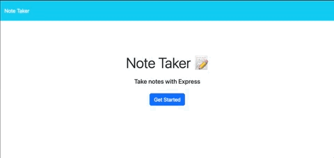

# Taker of Notes
An expresss js note taker 

# Description
This project uses Express running on Heroku to create a note taking app.

# Completed Task
- Made server.js file to use Express and point to the different route file
- Made Html route file to point to notes and everything to the index file
- Made the api route file to handle GET, POST and DELETE requests

# Links
[Code Repository](https://github.com/Justin-Brueske/taker-of-notes)

[Depoloyed site](https://taker-of-notes.herokuapp.com/)

# Usage
Use to take notes

